# torchcst アーキテクチャ設計ワークベンチ

> **履歴文書:** 現行APIの説明ではない。現在の実装契約と文書の位置づけは
> [`docs/README.md`](README.md) を参照すること。
>
> 状態: 議論用ドラフト。まだ実装仕様ではない。
>
> 現在worktreeにある未コミットのPolicy/Context書き直しも、正解としては
> 扱わない。良かった点と、まだ不自然な点を見つけるための比較対象とする。
>
> **2026-07-20追記:** Global PolicyとEngine-managed observation routingへ戻して
> MVPを再検討する新しいRFCを
> [`policy_engine_mvp_rfc.md`](policy_engine_mvp_rfc.md) に分離した。新RFCは
> D-001を再検討しており、合意までは両文書の矛盾を未決事項として扱う。

## 採用済みの設計判断

### D-001: PyTorch-native Policy lifecycle

状態: **採用**

- `backward`という名前はautograd phaseとhook実装にだけ使う。
- `SynapseBackwardAccess`、`SynapseBackwardEvent`は作らない。
- Policyは`prepare()`時に必要なStorage handleとcaptureをbindする。
- gradient取得にはPyTorchのTensor/Module hookを使う。
- captureしたtensorはdetachし、Policy所有Observerへ蓄積する。
- Policyは`step()`でStore固有Opを含む`MutationPlan`を返す。
- SETのようにgradient不要なPolicyはcaptureを登録しない。
- RigLのようにgradientが必要なPolicyだけcaptureを登録する。
- ScheduleとPolicyの判断ロジックは別の責務にする。

この判断を変更する場合は、実装の都合ではなく、新しいPolicyをこのlifecycleで
表現できない具体例を示す。

## 1. 何を決めたいのか

次の4問を混ぜずに答えられる設計にしたい。

1. モデル状態と構造mutationを誰が所有するのか。
2. forward/backwardを誰が観測でき、渡してよい情報の上限は何か。
3. 時間方向に蓄積する判断材料をどこに置くのか。
4. 判断材料からStore固有のOpを作るのは誰か。

現在混乱している主因は、この4問すべてを、1個の汎用`Policy`、1個の汎用
`Context`、1個の汎用`Reading`系インターフェースで解こうとしたことにある。

この文書では、まず次を作業仮説とする。

- Store、View、Op、GradRecord、observer、local policyは、基本的に
  **entity family固有**である。
- Engineはentity-neutralに保つ。
- entityをまたぐ協調は、汎用Contextの辞書へ隠さず、明示的なcomposite
  policyとして表現する。

### 1.1 まず実行責務で5分割する

最初に考える分割軸は、entity familyではなく次の5責務とする。

1. **Engine**: lifecycle、binding、clock、routingを担当する。
2. **Forward**: 現在のStorageを使って計算し、forward境界の事実を公開する。
3. **Backward**: gradientを受け取り、Policyが観測できるbackward境界を公開する。
4. **Policy**: 観測結果と現在のStorage Viewから、構造変更を判断する。
5. **Storage**: model state、entity identity、物理配置、mutationを所有する。

synapse/neuronは、この5分割とは別の軸である。例えばStorageの中に
SynapseStorageとNeuronStorageがあり、Policyの中にSynapsePolicyとNeuronPolicyが
ある。責務の分割とentityの分割を一段のdirectory hierarchyだけで表現しようと
すると、どちらかが不自然になる。

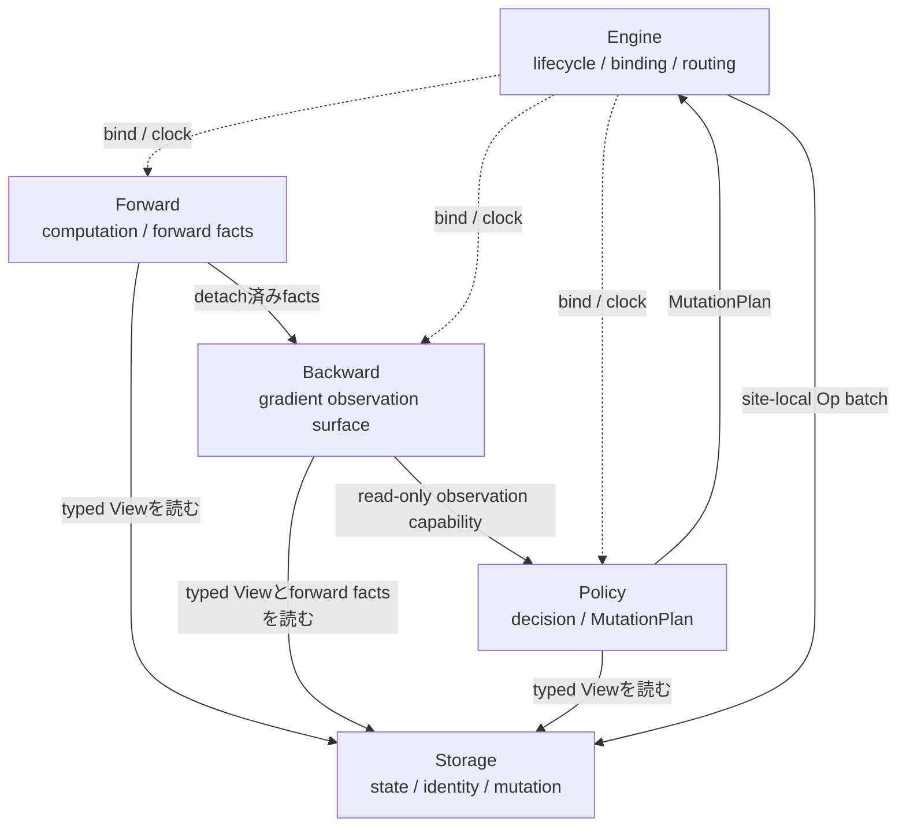

ここで`Backward --> Policy`は、Policyが具体的なbackward実装をimportするという
意味ではない。Policyが依存するのは、Backwardが公開する安定したread-only契約
だけである。

### 1.2 「取得できる情報をすべて渡せる」の意味

Policyは主なユーザー拡張点なので、frameworkがcSET/cRigLに必要な情報だけを
選んで固定してはいけない。一方、毎回すべてのtensorをmaterializeして巨大な
Contextへ詰めるのも避ける。

ここでは次を作業仮説とする。

- Backwardは、その計算境界で正当に取得できる**raw factsの最大面**を公開する。
- Engineが巨大Contextを作って全tensorをPolicyへpushすることはしない。
- Policyは`prepare()`時に、必要なStorage handleとPyTorch hook/captureをbindする。
- hookが受け取ったtensorは、Policy所有のcollectorへdetachして蓄積する。
- 高価な派生情報はPolicy側でlazyに計算し、同一step内ではcacheできる。
- Policyごとの「必要情報宣言」は、正しさの基本契約ではなく、binding時の検証や
  capture最適化として後から追加できる。

イメージ:

```python
class Policy(ABC):
    def prepare(self, binding: PolicyBinding) -> None: ...
    def step(self, clock: Clock) -> MutationPlan: ...


class RigL(Policy):
    def prepare(self, binding: PolicyBinding) -> None:
        self.synapses = binding.synapse_store("l1")
        self.grads = binding.capture.grad_records("l1")

    def step(self, clock: Clock) -> MutationPlan:
        view = self.synapses.view()
        # self.gradsとviewからdeath/birthを選ぶ
        ...
```

`PolicyBinding.capture`はPyTorch hookを登録するための薄いfacadeであり、独自の
backward engineではない。上級Policyには、通常の`nn.Module` hook相当まで到達
できるescape hatchを用意する余地がある。

「すべて」に含めないものも明示する。

- autograd graphそのもの。
- mutableなStorage。
- slot/free-listなどの物理配置。
- optimizer state。必要なら別の明示的capabilityにする。
- Policyを一つ想定して加工済みにしたbirth/death candidate。

この境界なら、BackwardはPolicyの選択ロジックを知らない。Policyはhookを直接
実装しなくてもよいが、何をcaptureするかはPolicy側が選ぶ。

### 1.3 PyTorch/RigL/SETから採る命名と構造

`SynapseBackwardAccess`、`SynapseBackwardEvent`という名前は撤回する。PyTorchで
`backward`はautogradの計算規則またはhook phaseを意味するため、Policy入力に
付けると誤解を生む。

| 役割 | 名前の候補 |
|---|---|
| `Tensor.register_hook()`へ登録するcallable | `OutputGradHook`、`ParamGradHook` |
| hookから得たdetach済みの1観測 | `ModuleGradRecord` |
| 時系列に蓄積するPolicy部品 | `GradEMA`、`CandidateProbe` |
| 座標ごとの勾配を問い合わせる派生機能 | `GradientProvider` |
| 構造更新アルゴリズム | `SET`、`RigL`、または`SETPolicy`、`RigLPolicy` |
| 更新時刻だけを決めるもの | `UpdateSchedule` |

PyTorch版RigLで参考になる分離:

- `RigLScheduler`がconstructorでparameter hookを登録する。
- hookはdense gradientを必要な期間だけ蓄積する。
- topology updateはweight magnitudeと蓄積gradientから行う。
- 通常のoptimizer stepとtopology update scheduleを統合する。

Google Researchの実装では、`MaskUpdater`が共通更新手順を持ち、`SET`と`RigL`が
`get_drop_scores()`と`get_grow_scores()`を差し替え、`UpdateSchedule`を別にする。
torchcstでもScheduleとPolicyを分離する根拠になる。

ただし既存RigL実装はdense weight maskを直接変更するため、Store transactionや
neuron/synapse複合mutationを扱うtorchcstへそのまま移植はしない。採るのは
`prepare -> hooks/grad -> step`というPyTorchらしいlifecycleである。

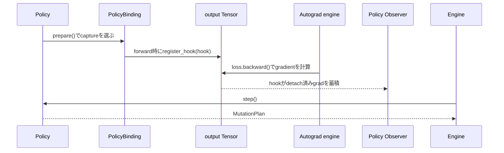

調査参照:

- [PyTorch Autograd mechanics: backward hooks](https://docs.pytorch.org/docs/main/notes/autograd.html#backward-hooks-execution)
- [PyTorch gradient hook tutorial](https://docs.pytorch.org/tutorials/intermediate/visualizing_gradients_tutorial.html#registering-hooks)
- [torchao sparsifier lifecycle](https://docs.pytorch.org/ao/stable/contributing/sparsity.html)
- [Google Research RigL `MaskUpdater`](https://github.com/google-research/rigl/blob/master/rigl/rigl_tf2/mask_updaters.py)
- [PyTorch RigL `RigLScheduler`](https://github.com/verbiiyo/rigl-torch/blob/master/rigl_torch/RigL.py)

## 2. 用語

| 用語 | 意味 |
|---|---|
| Entity family | synapse、neuronなどの構造種別。将来、新しいfamilyを追加できること。 |
| Site | `l1`、`hidden`など、Storeインスタンスの論理的な識別子。 |
| Store | 学習状態、entityの同一性、物理配置、mutation意味論を所有する。 |
| View | Storeが公開する読み取り専用の論理状態。slotやmutationメソッドは公開しない。 |
| Op | `SynapseBirth`など、Store family固有のmutation命令。 |
| Read port | 1つのsiteへbind済みで、現在のtyped Viewだけを返す読み取り専用facade。 |
| Grad record | PyTorch hookで得たgradientとforward時のraw factsを結びつけた一時的な観測。 |
| Observer | Viewやgrad recordを時系列に蓄積する。Opの選択は行わない。 |
| Controller | 1つ以上の同種Storeに対する判断を行い、そのStoreのOpを作れるもの。 |
| Policy | Controllerそのもの、または複数Controllerを協調させるもの。出力はmutation plan。 |
| Mutation plan | EngineがStoreへrouteする、複数のsite-local Op batch。 |

ObserverとPolicyの区別は重要である。

```text
Observer: tensor/event -> 時間方向に蓄積したtensor
Policy:   蓄積tensor + 現在View -> Op
```

例えば`CandidateProbe`は候補座標とscoreを作ってよい。しかし候補数を決めて
`SynapseBirth`を作るのはcRigL Policyの仕事である。

## 3. 安定していそうな境界

以下は今回の再設計後も残せそうな境界である。

### 3.1 Store境界

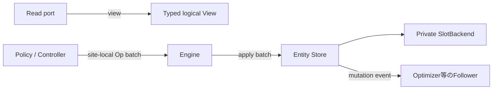

規則:

- PolicyへmutableなStoreオブジェクトを渡さない。
- Policyへslot、free list、物理rowを渡さない。
- EngineはOpのentity固有fieldを見ず、routeだけを行う。
- Storeはsite-local batchを検証し、transactionとして適用する。
- `SlotPool`と`BalancedSlotPool`はStore境界の内側の実装戦略とする。

### 3.2 Compute境界

複数entity familyが交わる場所はComputeである。例えば`CSTLinear`は、入力
neuron、出力neuron、synapse、kernelを合成している。

したがって、gradientとforward時の生情報を結びつけられるのもComputeである。

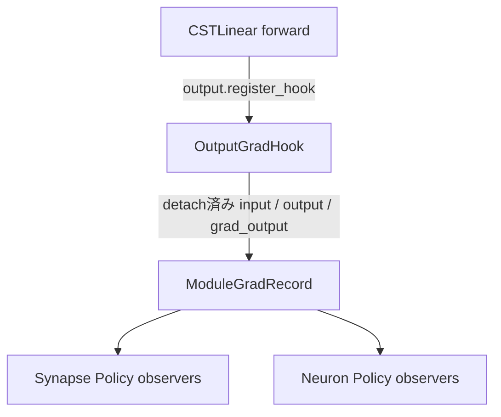

Engineが`CSTLinear`からsynapse gradient fieldを導出する方法を知るべきでは
ない。Policyがprepare時にbindしたcapture helperが、PyTorch hookから
module-localなraw recordを作る。1つの`ModuleGradRecord`をsynapse/neuron両方の
observerが異なる解釈で利用できるため、Backward側でentity別eventへ早々に
分割しない。

### 3.3 Policy境界

Policyの最終責務はOpを作ることである。

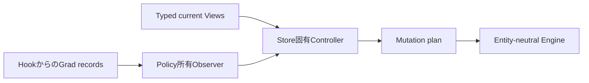

Observerクラスは再利用可能でもよいが、observer instanceとその蓄積状態は
bind済みPolicy/Controllerが所有する。StoreにもEngineにも持たせない。

## 4. 誰と誰が何を話すのか

| From | To | Payload | 許可すること | 禁止すること |
|---|---|---|---|---|
| Store | Compute | Typed View | 論理的なlive状態の読み取り | slot配置、mutationメソッド |
| Store read port | Policy/Controller | Typed current View | 判断用のread-only入力 | Storeへの直接アクセス |
| Compute output | Policy capture | PyTorch hookのgradient | detachしてPolicy状態へ蓄積 | Op生成、Store mutation |
| Policy capture | Observer | module-local GradRecord 1件 | Policy状態への蓄積 | autograd graphの保持 |
| Observer | Controller | Raw typed snapshot | ID、座標、score、counter | framework共通規則としてbirth/deathを選ぶこと |
| Controller | Policy coordinator | Store固有proposalまたはOp batch | entity-localな判断 | batchの適用 |
| Policy | Engine | Mutation plan | siteとOp batch | Store内部情報 |
| Engine | Store | Site-local Op batch | routeと実行 | `SynapseBirth`等による分岐 |
| Store | Followers | 物理mutation change | optimizer等のrow整合 | Policy判断 |

## 5. ライフサイクル

### 5.1 Binding

文字列site名をtyped objectへ変換するのはbinding時の一度だけにしたい。
binding後のPolicyは、`dict[str, View]`とcastではなく、typed read portと
prepare時に登録したcaptureを使う。

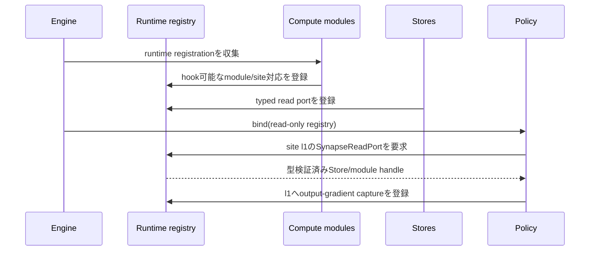

次の場合はbinding時に即座に失敗させる。

- siteが存在しない。
- Policyがsynapse siteを要求したのにneuron siteだった。
- 必要なcapture pointをcompute graphが提供していない。
- 互換性のないruntime componentが同じsite/capture roleをclaimした。

### 5.2 Forward / backward

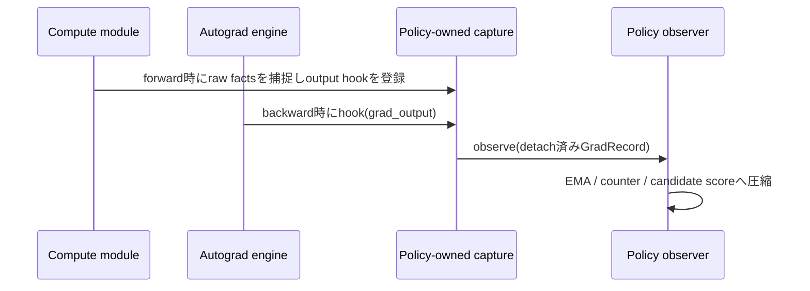

Grad recordは一時的である。Observerが保持できるのはdetach済みの
Policy所有summary stateだけとする。

### 5.3 Optimizer後のstructural step

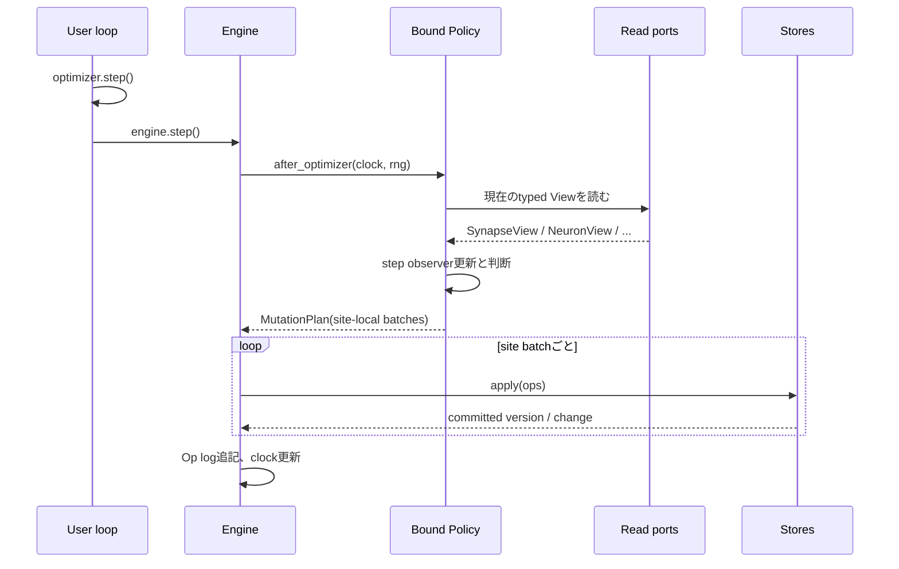

この形なら、汎用`DecisionContext.views: dict[str, View]`は不要になる。bind済み
Controllerが、自分のsiteに対応するtyped read portを保持すればよい。

## 6. Entity固有のdecision surface

汎用coreへ`KernelPort`、`CandidateScores`、neuron gate signalなどを置かない。
各entity familyが、自分のdecision surfaceを定義する。

### 6.1 Synapse decision surface

型のたたき台:

```python
class SynapseReadPort(Protocol):
    site: str
    def view(self) -> SynapseView: ...


class GradientProvider(Protocol):
    def live_weight_gradient(self) -> Tensor: ...
    def candidate_gradient(self, s: Tensor, t: Tensor) -> Tensor: ...
```

`GradientProvider`はBackwardそのものではない。`ModuleGradRecord`とSynapse Viewを
使い、synapse座標へ勾配を写すForward側adapter
である。将来、別のgradient推定を使うPolicyは別Providerを選べる。

Synapse-local observerの例:

- `MassEMA`: optimizer後に`SynapseReadPort.view()`から更新する。
- `GradEMA`: `GradientProvider`から更新する。
- `CandidateProbe`: `GradientProvider`へ候補座標を問い合わせる。
- 将来のmerge距離、transport costなど。

Synapse-local policyの例:

- cSET。
- cRigL。
- merge/split policy。
- fixed-cardinality rewire policy。

### 6.2 Neuron decision surface

Neuron mutationは、単なる別のsynapse policyではない。View、observer、Op、
GradRecordの解釈が異なる。

型のたたき台:

```python
class NeuronReadPort(Protocol):
    site: str
    def view(self) -> NeuronView: ...
```

1つのNeuron siteが複数Compute moduleに参加する場合がある。同一training stepの
複数`GradRecord`を、input/outputのroleとsite対応に従って1つのobserverへ集約
できなければならない。このrole mappingはprepare/binding時に確定する。

Neuron-local observerの候補は、gate magnitude、gate gradient、activation
utility、rent counterなど。Neuron-local policyが`NeuronBirth`、
`NeuronDeath`、`NeuronKick`を作る。

`ModuleGradRecord`の正確な情報上限は、input/output/grad_outputを標準面とし、
grad_inputはnative hook escape hatchで取得する方針とする。

## 7. Local Controllerとcross-entity Policy

多くのPolicyはStore family固有になるはずである。

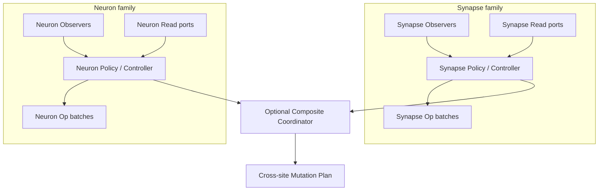

例:

- cSETはsynapse policyであり、neuron型をimportしない。
- cRigLはsynapse gradient-field eventを消費するsynapse policyであり、
  `CSTLinear`を直接importしない。
- hidden unit removalはneuron policyである。
- neuronと全incident synapseを同時に削除するものは、neuronとsynapse両方の
  decision surfaceを明示的にimportするcomposite policyである。

すべてをgeneric Policyと呼びながら内部でdowncastするより、この依存を正直に
表面化した方がよい。

## 8. Mutation Planとatomicity

最小のplan形状:

```python
@dataclass(frozen=True)
class SiteBatch:
    site: str
    ops: tuple[Op, ...]


@dataclass(frozen=True)
class MutationPlan:
    name: str
    batches: tuple[SiteBatch, ...]
```

Engineがrouteのために読むのは`site`だけとする。

### 未決: 複数Storeのatomicity

synapse-only rewireならStoreごとのatomicityで足りる。しかし、neuron deathと
全incident synapse deathはgroup atomicityが必要かもしれない。

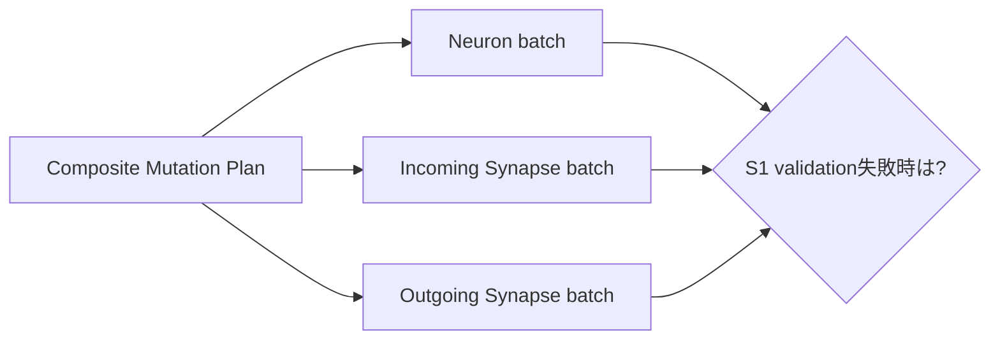

候補:

1. **Storeごとのatomicityのみ**: 最も簡単だが、composite policyが部分適用
   される可能性がある。
2. **Prepare/commit**: 全Storeがmutationせずprepareし、全batch成功後にcommit。
3. **Aggregate Store**: 強く結合したentityを1つのtransaction ownerにする。

Neuron/synapse協調mutationが実要件なら、2が最も一般的である。その場合、
prepared mutationという概念は必要になるが、Engine内のad hocな
`validate_batch`ではなく、Store transaction境界に置くべきである。

これは`EntityStore.apply`を確定する前に決めたい。

## 9. 推奨する依存方向

矢印は「importしてよい」を表す。

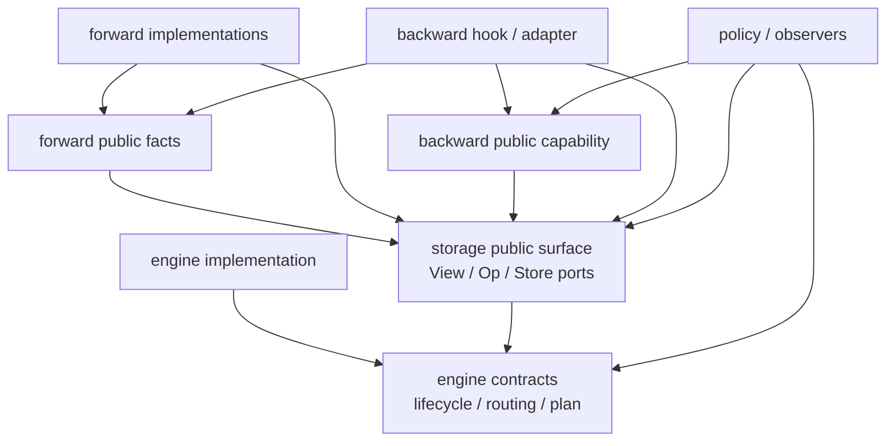

禁止する依存:

- Engine implementationはsynapse、neuron、具体Forward、具体Backward、具体Policyを
  importしない。
- StorageはForward、Backward、Policyをimportしない。
- ForwardはBackwardや具体Policyをimportしない。
- Backwardは具体Policyをimportしない。
- Policyは具体backward hookや具体Forward moduleをimportしない。
- Engineは具体View/Op classで分岐しない。
- synapse-only policyはneuron型をimportしない。
- neuron-only policyはsynapse型をimportしない。
- ObserverはOpを適用しない。
- Forward/BackwardはOpを作らない。

重要なのは、`backward public capability`がPolicyのためだけの加工済みscoreを
定義しないこと。Backwardは観測可能なraw factsを公開し、どの組み合わせを使うかは
Policyに残す。

## 10. ディレクトリ構成案

第一階層は実行責務の5分割を優先し、その内側でentity familyを分ける案:

```text
src/torchcst/
├── engine/
│   ├── engine.py           # lifecycleとrouting
│   ├── registry.py         # typed binding
│   ├── plan.py             # SiteBatch / MutationPlan
│   └── clock.py
├── storage/
│   ├── common/
│   │   ├── contracts.py
│   │   ├── slots.py        # private backend
│   │   └── followers.py
│   ├── synapse/
│   │   ├── types.py        # SynapseView / SynapseOp
│   │   └── store.py
│   └── neuron/
│       ├── types.py        # NeuronView / NeuronOp
│       └── store.py
├── forward/
│   ├── contracts.py        # forward factの公開境界
│   ├── linear.py
│   └── conv.py
├── backward/
│   ├── hooks.py            # OutputGradHook等のPyTorch連携
│   ├── records.py          # ModuleGradRecord / GradientProvider
│   └── capture.py          # PolicyBindingへ公開するcapture facade
├── policy/
│   ├── common.py           # BoundPolicyなど最小contract
│   ├── synapse/
│   │   ├── observers.py
│   │   ├── cset.py
│   │   └── crigl.py
│   ├── neuron/
│   │   └── ...
│   └── composite/
│       └── ...              # 明示的なcross-entity協調
└── __init__.py              # curated public re-export
```

この案では依存を次のように読む。

- `forward/*`、`backward/*`、`policy/*`は`storage/*`の公開型へ依存してよい。
- `policy/*`は`backward/*`のcapture facadeとGradRecordへ依存してよい。
- `backward/*`は具体Policyをimportしない。
- `engine/*`は具体synapse/neuron型へ依存しない。
- entity固有型は各責務の第二階層に閉じ込める。

欠点は、1つのentity変更が複数の第一階層directoryへまたがること。ただしこれは
実際の責務境界を表しており、globalな汎用Contextへ依存を隠すより追跡しやすい。

## 11. 現在の実験実装から得たもの

| 現在の実験 | 残したいか | 理由 |
|---|---:|---|
| Policyがobserver stateを所有 | Yes | Engineが異種decision stateを所有するべきではない。 |
| Observerがraw score tensorを返す | Yes | 選択はPolicyの仕事。 |
| `Reading`/`cast` registryを廃止 | Yes | incompatibleなentity dataを偽の共通型へ隠していた。 |
| Generic `BackwardContext`に`KernelPort` | Probably no | `KernelPort`はsynapse/CSTLinear固有なのにcoreへ漏れている。 |
| `DecisionContext.views: dict[str, View]` | Probably no | binding後も具体型を失い、毎回narrowingが必要。 |
| Engineが`CSTLinear`をimport | No | Compute固有event生成はregistrationにするべき。 |
| Engineが`SynapseStore`をimport | No | optimizer/follower attachmentはgeneric capabilityにするべき。 |
| Global `decision/instruments.py` | No | 既に`SynapseView`へ直接依存している。directoryも依存を認めるべき。 |
| Global `decision/policies.py` | No | cSET/cRigLはuniversal policyでなくsynapse policy。 |

## 12. アーキテクチャ受け入れ条件

次の実装へ進む前に、まず紙上で満たし、その後code testとして固定したい。

1. 新しいEntity Storeを追加してもEngineを編集しない。
2. 新しいCompute componentを追加してもEngineへentity固有分岐を足さない。
3. cSETを`cast`、`isinstance`、bind後の文字列data lookupなしで書ける。
4. synapse policyはneuron実装をimportしない。
5. neuron policyはsynapse実装をimportしない。
6. composite policyがneuron/synapse controllerを明示的に協調できる。
7. backward observerが誤ってautograd graphを保持できない。
8. PolicyはOpを返す以外の方法でStoreをmutationできない。
9. Engine routingはsiteだけを見て、具体Op内容を見ない。
10. Fixed-cardinalityと汎用SlotBackendをStore背後で差し替えられる。
11. Policy observer stateを将来model stateと独立checkpointできる。
12. Multi-store planの部分失敗に明示的な答えがある。

## 13. 残っている設計判断

### Policyの構成

`Policy`はneuron/synapseのどちらか一方を意味するものではなく、構造可塑性アルゴリズム全体を表す。`cSET`と`cRigL`がこの全体Policyであり、その内部にsynapse側・neuron側のコンポーネントを持つ。

```text
Policy (cSET / cRigL)
  ├─ SynapsePolicy
  └─ NeuronPolicy
```

各コンポーネントは自身のStoreとbackward観測を担当する。Engineは全体Policyだけを扱い、Policyが各コンポーネントの結果をMutationPlanへまとめる。

新APIで確定済みの事項は、ここへ戻さない。未決なのは実装を前に進めるために
判断が必要なものだけとする。

### 優先度: 高

- [x] `ModuleGradRecord`のcapture上限をinput / output / grad_outputに固定する。
- [x] `grad_input`はnative backward hookでcaptureし、Policy処理はbackward完了後に行う。
- [x] `CSTEngine.backward(loss)`をautograd実行とcapture確定の境界にする。
- [ ] neuron + synapse複合mutationにprepare/commitが必要か決める。
- [ ] `PolicyBinding`のsite指定を文字列からtyped `SiteRef`へ移行するか決める。

### 優先度: 中

- [ ] 同じcapture pointを複数Policyで共有する場合のcollector重複を整理する。
- [ ] Policy/observer stateのcheckpoint/restore形式を決める。
- [ ] `GradientProvider`をframework標準部品にするかPolicy側instrumentにするか決める。
- [ ] distributed時のcapture、observer、MutationPlanのrank ownershipを決める。
- [ ] native PyTorch hook escape hatchを上級Policyへ公開するか決める。

## 14. Roadmap

### Phase 0: lifecycle基盤（完了）

- [x] `Policy.prepare()` / `Policy.step()`を導入する。
- [x] `PolicyBinding`とtyped `ReadPort`を導入する。
- [x] PyTorch Tensor hookから`ModuleGradRecord`をcaptureする。
- [x] `MutationPlan`とsite-local `SiteBatch`を導入する。
- [x] Engineをsite routingだけの実装にする。

### Phase 1: 現行Linear/Synapseの完成（完了）

- [x] SETをgradient captureなしで動かす。
- [x] RigLをPolicy-owned captureで動かす。
- [x] SlotPool/BalancedSlotPoolとFollowerをStorage内部に閉じ込める。
- [x] birth/death後のoptimizer stateをzero化する。
- [x] Linear + SET/RigLのE2Eテストを通す。

### Phase 2: APIと状態管理の強化（次）

- [x] `ModuleGradRecord`の情報上限とmemory lifetimeを文書化する。
- [ ] Policy/observer stateの`state_dict`を実装する。
- [ ] capture handleのcloseと再prepareを完全に検証する。
- [ ] typed `SiteRef`または同等のbinding契約を導入する。
- [ ] MutationPlanのvalidationとop logの仕様を固定する。

### Phase 3: Entity拡張

- [ ] neuron-local Policyを1つ実装する。
- [ ] NeuronBirth/Deathとincident Synapseの複合mutationを設計する。
- [ ] multi-store prepare/commitまたはAggregate Storeを実装する。
- [ ] merge/kickをStore固有Opとして追加する。

### Phase 4: Compute拡張

- [ ] `ModuleGradRecord`をConv captureへ適用し、CSTConv2dを実装する。
- [ ] captureの複数Policy共有を実装する。
- [ ] gate utility用のcapture面を設計する。

### Phase 5: 運用機能

- [ ] checkpoint save/loadを実装する。
- [ ] distributed rank ownershipとOp broadcastを実装する。
- [ ] replay可能なMutationPlan/op log形式を固定する。

## 15. 次に行う設計exercise

次はPhase 2のcheckpoint形式とbackward capture契約を決める。その後、neuron-local Policyを1つ実装して、synapse専用の
抽象が混入していないことを確認する。

## 15. D-001に基づく最小Policy sketch

ここではbinding APIの細部をまだ確定しない。SETとRigLの情報要求が異なることを
interface上で確認する。

### 15.1 共通lifecycle

```python
class Policy(ABC):
    @abstractmethod
    def prepare(self, binding: PolicyBinding) -> None:
        """Store handleを解決し、必要ならPyTorch hookを登録する。"""

    @abstractmethod
    def step(self, update: UpdateRequest) -> MutationPlan:
        """Policy所有stateと現在ViewからOpを作る。"""


class UpdateSchedule(Protocol):
    def poll(self, clock: Clock) -> UpdateRequest | None: ...
```

Engineは`Schedule.poll()`が返した`UpdateRequest`をPolicyへ渡すだけで、drop率や
gradient、具体Opを解釈しない。

### 15.2 SET

```python
class SET(Policy):
    def prepare(self, binding: PolicyBinding) -> None:
        self.store = binding.synapse_store(self.site)
        # gradient captureは登録しない。

    def step(self, update: UpdateRequest) -> MutationPlan:
        view = self.store.view()
        deaths = smallest_magnitude(view, update.count)
        births = random_free_coordinates(view, update.count, self.rng)
        return synapse_plan(self.site, deaths, births)
```

SETが必要とするのは、現在のSynapse View、乱数、更新数だけである。

### 15.3 RigL

```python
class RigL(Policy):
    def prepare(self, binding: PolicyBinding) -> None:
        self.store = binding.synapse_store(self.site)
        self.probe = CandidateProbe(...)
        self.capture = binding.capture.grad_records(
            self.site,
            observer=self.probe.observe,
        )

    def step(self, update: UpdateRequest) -> MutationPlan:
        view = self.store.view()
        deaths = smallest_magnitude(view, update.count)
        births = self.probe.topk(view, update.count)
        return synapse_plan(self.site, deaths, births)
```

RigLの`step()`はBackward objectを受け取らない。`prepare()`で登録したhookが、
通常の`loss.backward()`中に`CandidateProbe`へ情報を蓄積済みだからである。

### 15.4 このsketchでまだ未決の部分

- `PolicyBinding.synapse_store()`のようなentity固有methodを誰が提供するか。
- `site`を文字列、typed `SiteRef`、module参照のどれにするか。
- `grad_records()`が何をcaptureするか。`input`、`output`、`grad_output`の
  保持期間とmemory上限。
- 同じcaptureを複数Policyで共有するか。
- `UpdateRequest`がcountだけか、drop fractionやstageも持つか。

次の設計対象は、巨大な汎用Contextを再導入せずに、このbindingをtypedにする方法
である。
