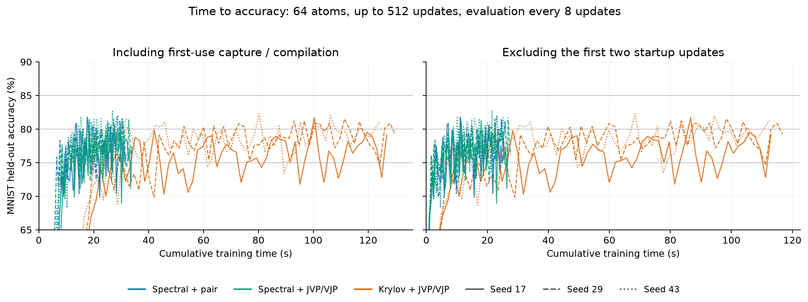

# 同じ精度までの時間・メモリ

2026-09-08。1stepの速度だけでなく、固定した評価精度へ到達するまでの実測時間と
ピークメモリを比較する。optimizerの式や学習設定は変更せず、求解・縮約経路だけを変えた。

## 事前に固定した条件

- MNIST: 8,192 train / 2,000 held-out、batch128、64 atoms / 256 parameters。
  前回と同じAmplitudeBandwidthSeparable、factored backend。
- seed17/29/43、同seedの初期parameterとbatch順のhash一致を確認する。
  固定shuffleをepochごとに繰り返す。最大512更新（8epoch）。
- lr0.05、betas0.9/0.99、radius0.25、damping0.01、separable D、全atom間の項を維持。
  再圧縮PCG上限1,024、rtol1e-5。Krylovは基底予算256、確認間隔32、rtol1e-5。
- 比較: spectral + pair（従来）、spectral + JVP/VJP、Krylov + JVP/VJP。
  Nyström前処理は公開optimizerには未接続なので、この学習比較には含めない。
- 目標75%・80%・85%。8更新ごとに評価する。
  「初回観測」と「3回連続の評価で基準以上だった確認」を分ける。
  後者の時間は3回目の評価時点であり、最初の到達時点へ遡って記録しない。
  評価の間を補間しないため、真の瞬間的な初回到達時間とは異なる。
  3回連続は3つのcheckpointでの確認であり、その間すべての更新での維持を保証しない。
- 到達しなければ未到達として残す。512更新目の時間を到達時間に置き換えず、
  到達したrunだけの中央値には必ず到達数を併記する。
  数値検査不合格ならその時点で止め、不合格stepの精度を評価しない。

A100 80GB PCIe MIG 3g.40gb、PyTorch 2.6.0+cu126、TF32無効、host 1 thread。
GPU実験は独立processで直列実行し、3seedで方式の実行順を循環させた。

## 時間とメモリの定義

主指標の「学習累積秒」はzero_grad / forward / backward / optimizer / GPU完了待ちの
実測合計。初回のコンパイル・CUDA Graph captureを含む。データ読み込み、model構築、
評価、診断の取り出し、JSON保存は含めない。
別に、最初の2更新の時間、そこから後の学習累積時間、評価時間、全体のwall timeを保存する。
wall timeはmodel/data準備後から評価完了までで、診断・保存も含む。
共有ディスクのコンパイルcacheは消していないため、完全に空のcacheからのcold-start試験ではない。

初回2更新を除いた図は定常部分の比較であり、その2更新を無料で実行できるという
実時間の推定ではない。評価精度は同じ学習軌道の値を使う。

メモリは計測開始から到達確認までのPyTorch peak allocated。
GPUに常駐する学習・評価データ、optimizer、CUDA Graph bufferと評価時の一時領域を含む。
初回2更新を除いた区間のpeakも別に保存する。driver/native libraryの全使用量やreservedとは異なる。
従ってこの値をoptimizer state単体のサイズと解釈しない。

## 結果

全9試行が512更新を完了し、4,608更新すべてで数値検査を通過した。
同じ精度への到達時間で見ると、この64-atomの条件ではKrylovの優位性は確認できなかった。
再圧縮だけを変えた場合も、到達時間の一貫した改善は確認できない。

時間は3seedの中央値。75%の3回連続確認・80%の初回観測はいずれも3/3seedで達成。
主列の秒数は初回capture/compilationを含む学習累積時間。

| 方式 | 75%・3回連続確認 秒 | 同・初回2更新除外 秒 | 80%・初回観測 秒 | 到達までのpeak MiB |
| --- | ---: | ---: | ---: | ---: |
| 従来: spectral + pair | 11.64 | 6.80 | 14.51 | 61.73 |
| spectral + JVP/VJP | 11.96 | 6.03 | 18.41 | 61.73 |
| Krylov + JVP/VJP | 43.82 | 30.09 | 52.90 | 71.20 |

peak値は各方式の3seedで共通で、今回の到達時点では初回2更新を除いたpeakとも一致した。
75%確認時の評価・診断・保存も含むwall timeの中央値は、従来11.88秒、
再圧縮変更12.22秒、Krylov44.18秒。主指標と同じ順序だった。

初回2更新を除くと、75%確認までの時間は再圧縮変更で少し短くなった。
ただし80%の初回観測では短縮しておらず、3seedだけから一律に優位とは判定しない。
Krylovは初期コストを除いてもこのモデルでは時間がかかり、peakも約15%大きい。

### 80%の3回連続確認と未到達

| 方式 | seed17 | seed29 | seed43 | 達成数 |
| --- | --- | --- | --- | --- |
| 従来: spectral + pair | 未達 | 408更新 / 26.12秒 | 未達 | 1/3 |
| spectral + JVP/VJP | 未達 | 未達 | 512更新 / 32.18秒 | 1/3 |
| Krylov + JVP/VJP | 未達 | 未達 | 160更新 / 45.90秒 | 1/3 |

512更新までに80%を3回連続で確認できたのは各方式1/3seed。
達成したseedが異なるため、この1件ずつの秒数を方式の代表的な到達時間として比較しない。
同じseed43ではKrylovは160更新、spectral + JVP/VJPは512更新で確認したが、
実時間ではKrylovの方が遅かった。少ない更新回数と短い時間は一致しない。
85%は全9試行で一度も観測されず、到達時間を算出できない。

512更新目の平均accuracyは、従来76.85%、再圧縮変更78.42%、Krylov79.85%。
最終accuracyではKrylovが高い一方、80%の初回到達までにはより長い時間を要した。
目的に応じて終点の精度と到達時間を区別する必要がある。



線分は観測checkpointをつないだもの。目標時間の算出では線形補間していない。
図の縦軸は65〜90%の範囲を表示する。

### 今回の判断

この小規模モデルではspectral更新を主にする判断が妥当。再圧縮JVP/VJPの採否は
初期コストと定常時間の両方を見て決める。大きいatom数で得たKrylovの速度改善を、
このモデルのtime-to-accuracyへそのまま適用できるという結果にはならなかった。
現在の固定設定では評価精度の振れが大きく、80%を再現よく連続確認できていない。
これは今回の設定での観測であり、一次optimizer全般の精度上限を意味しない。

## 解釈の範囲

同じ精度へ一度到達することと、学習を安定して続けられることは別の指標。
前回128更新目のaccuracyだけを見た比較とは区別する。
この固定設定・小規模の単一層MNISTでの比較であり、大きいatom数や他のモデルについて
同じ到達時間・順位を示すものではない。評価subsetを継続監視しているため、設定選択後の
独立した最終test精度の推定でもない。

## 再現

```sh
bash experiments/run_time_to_accuracy_a100.sh DATA/MNIST/raw output/TRIALS
PYTHONPATH=src:. python -m experiments.summarize_accuracy_time --input output/TRIALS --output docs/experiments/time-to-accuracy-results.json
```

[集約JSON](time-to-accuracy-results.json)には各評価checkpoint、目標到達記録、source fingerprint、
初期値・batch順のhash、完了または失敗状態を保存する。


検証: CPUテスト400 passed / 73 skipped、`ruff check .`合格。
到達時間の集計には、閾値付近の上下、確認時刻の逆算禁止、未到達を時間に変換しないことの
回帰テストを追加した。全9試行の初期値・batch順と実験sourceの一致も検証している。
生ログ・各stepの診断は `output/time-to-accuracy-results.tgz` に保存し、archiveのSHA256は
集約JSONに記録した。
